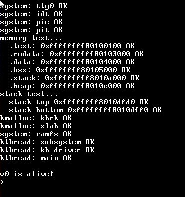

# kernel
a basic kernel made to x86

# Boot
# Prekernel
- https://chatgpt.com/c/69273a2d-ff88-8332-8ac7-70296ca9ac70
# Kernel
## PML4
- 4 KiB pages (PTE) for each section (.text, .rodata, .data, .bss etc).
## ISRs
### keyboard (ps1)
- minimal structure
- fill keyboard buffer with scancodes
- spinlock or disable IRQ while writing to the buffer (avoiding race condition)
## VGA
- `0xb8000` as always
- due to VA == PA -> VGA is virtually mapped to `~0xffffffff000b8000`
## Threading
- kernel thread creation
- cooperative (non-preemptive) round-robin scheduling
- context switching in System V ABI–oriented (x86_64)
- wait queues
- counting semaphores
- a dedicated idle thread
- all threads share the same address space and heap
### Thread States
- UNUSED -> slot available
- RUNNABLE -> eligible to run
- RUNNING -> currently executing
- BLOCKED -> sleeping on a wait queue
- ZOMBIE -> finished execution, pending cleanup
### Run queue
- O(1) enqueue
- O(1) next-thread selection
- TODO priority handling
- cooperative only
- every thread yields explicitly via `kthread_yield()`
### Context Switching
- made by `void context_switch(uint64_t** old_sp, uint64_t* new_sp)`
- push callee-saved registers
- store current `RSP` into `*old_sp`
- load `new_sp` into `RSP`
- restore registers
- `ret` into the new thread context
### Thread Stack Layout
| top                     |
| ----------------------- |
| r15                     |
| r14                     |
| r13                     |
| r12                     |
| rbx                     |
| rbp                     |
| return -> kthread_entry |
| arg                     |
| fn                      |
| **bottom**              |
- SP is aligned to 16 bytes
## Devices
### TTY
- (console driver) vga_putc() e vga_popc() -> who actually handles with the screen
- (keyboard driver) consumes the scancodes from the keyboard buffer populated by the ISR
- ldisc_input applies terminal methods (echo, canonical/non-canonical, backspace, etc) and handles with ASCII
- holds the input buffer that will be consumed by stdin (when tty->line_ready == true)
### stdin
- fd 0
- bufferized -> ring buffer
- free for read(0)
- is connected to TTY -> sleeps and reads the input buffer when it is woken up
### stdout
- fd 1
- bufferized -> ring buffer
